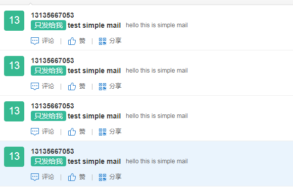

### pom包配置
``` xml
 <dependency>
        <groupId>org.springframework.boot</groupId>
        <artifactId>spring-boot-starter-mail</artifactId>
  </dependency>
```
<!-- more -->
### 在application.properties中添加邮箱配置
``` xml
#邮箱服务器地址
spring.mail.host=smtp.163.com
#用户名
spring.mail.username=xxx@oo.com
#密码
spring.mail.password=xxyyooo 
spring.mail.default-encoding=UTF-8
#以谁来发送邮件
mail.fromMail.addr=xxx@oo.com
```
### MailService
``` java
public interface MailService {
    void sendSimpleMail(String to, String subject, String content);

     void sendHtmlMail(String to, String subject, String content);

    void sendAttachmentsMail(String to, String subject, String content, String filePath);

     void sendInlineResourceMail(String to, String subject, String content, String rscPath, String rscId);
}
```
### MailServiceImpl
``` java 
@Component
public class MailServiceImpl implements MailService {


    private final Logger logger = LoggerFactory.getLogger(this.getClass());
    @Autowired
    private JavaMailSender mailSender;

    @Value("${mail.fromMail.addr}")
    private  String from;
    /**
     * 发送文本邮件
     * @param to
     * @param subject
     * @param content
     */
    @Override
    public void sendSimpleMail(String to, String subject, String content) {
        SimpleMailMessage message = new SimpleMailMessage();
        message.setFrom(from);
        message.setTo(to);
        message.setSubject(subject);
        message.setText(content);

        try {
            mailSender.send(message);
            logger.info("简单邮件已经发送。");
        } catch (Exception e) {
            logger.error("发送简单邮件时发生异常！", e);
        }
    }
    /**
     * 发送html邮件
     * @param to
     * @param subject
     * @param content
     */
    @Override
    public void sendHtmlMail(String to, String subject, String content) {
        MimeMessage message = mailSender.createMimeMessage();

        try {
            //true表示需要创建一个multipart message
            MimeMessageHelper helper = new MimeMessageHelper(message, true);
            helper.setFrom(from);
            helper.setTo(to);
            helper.setSubject(subject);
            helper.setText(content, true);

            mailSender.send(message);
            logger.info("html邮件发送成功");
        } catch (MessagingException e) {
            logger.error("发送html邮件时发生异常！", e);
        }
    }
    /**
     * 发送带附件的邮件
     * @param to
     * @param subject
     * @param content
     * @param filePath
     */
    @Override
    public void sendAttachmentsMail(String to, String subject, String content, String filePath) {
        MimeMessage message = mailSender.createMimeMessage();

        try {
            MimeMessageHelper helper = new MimeMessageHelper(message, true);
            helper.setFrom(from);
            helper.setTo(to);
            helper.setSubject(subject);
            helper.setText(content, true);

            FileSystemResource file = new FileSystemResource(new File(filePath));
            String fileName = filePath.substring(filePath.lastIndexOf(File.separator));
            helper.addAttachment(fileName, file);
            //helper.addAttachment("test"+fileName, file);

            mailSender.send(message);
            logger.info("带附件的邮件已经发送。");
        } catch (MessagingException e) {
            logger.error("发送带附件的邮件时发生异常！", e);
        }
    }
    /**
     * 发送正文中有静态资源（图片）的邮件
     * @param to
     * @param subject
     * @param content
     * @param rscPath
     * @param rscId
     */
    @Override
    public void sendInlineResourceMail(String to, String subject, String content, String rscPath, String rscId) {
        MimeMessage message = mailSender.createMimeMessage();

        try {
            MimeMessageHelper helper = new MimeMessageHelper(message, true);
            helper.setFrom(from);
            helper.setTo(to);
            helper.setSubject(subject);
            helper.setText(content, true);

            FileSystemResource res = new FileSystemResource(new File(rscPath));
            helper.addInline(rscId, res);

            mailSender.send(message);
            logger.info("嵌入静态资源的邮件已经发送。");
        } catch (MessagingException e) {
            logger.error("发送嵌入静态资源的邮件时发生异常！", e);
        }
    }
}
```

### 定时发送邮件
``` java 
@Component
@EnableScheduling // 启用定时任务
public class SchedulUtil {
    private final Logger logger = LoggerFactory.getLogger(getClass());
    private static final SimpleDateFormat dateFormat = new SimpleDateFormat("HH:mm:ss");


    @Autowired
    private MailService mailService;
//    @Scheduled(cron = "0/5 * * * * ?") // 每20秒执行一次
    @Scheduled(fixedRate = 6000) //每6秒
    public void testSimpleMail() {
        logger.info("现在时间：" + dateFormat.format(new Date()));
        mailService.sendSimpleMail("15180191339@139.com","test simple mail"," hello this is simple mail");
    }
    @Scheduled(fixedRate = 60000) //每分钟
    public void sendInlineResourceMail() {
        String rscId = "neo006";
        String content="<html><body>这是有图片的邮件：</body></html>";
        String imgPath = "F:\\OuYangResume.github.io\\source\\_posts\\Vue优雅使用echarts\\bar.png";

        mailService.sendInlineResourceMail("zhangwenguang123@qq.com", "主题：这是有图片的邮件", content, imgPath, rscId);
    }
}
```
### 收到你的早安，晚安和gun。
<div  align="center">
</div>

