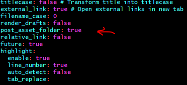
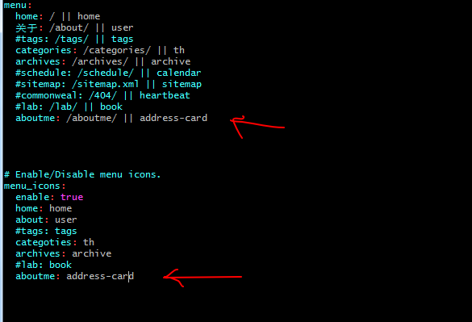

___
## 文章插入图片
1. 在站点配置文件`_config.yml`中的`post_asset_folder:`这个选项设置为`true`。

<!-- more -->
2. 在hexo目录下执行 `npm install hexo-asset-image --save`,这是下载安装一个可以上传本地图片的插件。
3. 运行`hexo new "xxx"`来生成文章时，在`/source/_posts`文件夹中生成一个同名的文件夹。

4. 最后在`xxx.md`中想引入图片时，先把图片复制到这个xxx文件夹中，然后按照markwown的格式引入图片：`！[替代文字](xxx/图片名.png)`。
___
## hexo-next添加自定义页面
1. 在hexo目录下创建你想要生成的页面	`hexo new page "aboutme"`。
2. 修改主题配置`_config.yml`文件中的 `menu`和`menu_icons`,如下图
  
其中`address-card`是在`font-Awesome`图库图标的名称。
3. 修改主题下的`netx/languages/zh-Hans.yml`文件中的`menu`。

4. 运行`hexo -s`效果图。

5. 设置站点配置文件`_config.yml`中的`skip_render`添加`aboutme/**`,这样就意味着根目录下的`source/aboutme`文件夹中的内容不会被转化成html。而是直接copy到`public`文件夹。
___
## <--[更多美味糖果](http://shenzekun.cn/hexo%E7%9A%84next%E4%B8%BB%E9%A2%98%E4%B8%AA%E6%80%A7%E5%8C%96%E9%85%8D%E7%BD%AE%E6%95%99%E7%A8%8B.html)-->

___更新线20180603___

必须记录一下白忙活一天的状态了。具体原因是hexo clean会清除public下的所有文件。
修改应该source文件下的文件。然后再执行hexo g 生成public。
