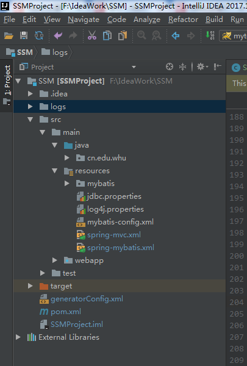

## 逆向工程
常用的逆向工程方式是通过数据库的表生成代码（包括mapper.xml、dao.java、bean.java）。
## 配置Maven的pom.xml文件
<!-- more -->
``` java
<!-- MyBatis代码生成 -->
      <plugin>
        <groupId>org.mybatis.generator</groupId>
        <artifactId>mybatis-generator-maven-plugin</artifactId>
        <version>1.3.2</version>
        <configuration>
          <verbose>true</verbose>
          <overwrite>true</overwrite>
          <configurationFile>generatorConfig.xml</configurationFile>
        </configuration>
        <dependencies>
          <!-- 数据库驱动 -->
          <dependency>
            <groupId>mysql</groupId>
            <artifactId>mysql-connector-java</artifactId>
            <version>5.1.30</version>
          </dependency>
        </dependencies>
      </plugin> 
```

## 编写generatorConfig.xml文件
 可以看到pom.xml文件中配置了generatorConfig.xml的所在位置
<div  align="center">
</div>

``` java
<?xml version="1.0" encoding="UTF-8"?>
<!DOCTYPE generatorConfiguration
        PUBLIC "-//mybatis.org//DTD MyBatis Generator Configuration 1.0//EN"
        "http://mybatis.org/dtd/mybatis-generator-config_1_0.dtd">

<generatorConfiguration>

    <context id="MySQLTables" targetRuntime="MyBatis3">
        <!--关闭注释 -->
        <commentGenerator>
            <property name="suppressDate" value="true"/>
        </commentGenerator>

        <!--数据库连接信息 -->
        <jdbcConnection driverClass="com.mysql.jdbc.Driver" connectionURL="jdbc:mysql://{{ip}}:3306/database?useUnicode=true&amp;characterEncoding=utf-8" userId="root"
                        password="{{密码}}">
        </jdbcConnection>

        <!--生成的model 包路径 -->
        <javaModelGenerator targetPackage="cn.edu.whu.bean" targetProject="F:\IdeaWork\SSM\src\main\java">
            <property name="enableSubPackages" value="ture"/>
            <property name="trimStrings" value="true"/>
        </javaModelGenerator>

        <!--生成xml mapper文件 路径 -->
        <sqlMapGenerator targetPackage="mybatis" targetProject="F:\IdeaWork\SSM\src\main\resources">
            <property name="enableSubPackages" value="ture"/>
        </sqlMapGenerator>

        <!-- 生成的Dao接口 的包路径 -->
        <javaClientGenerator type="XMLMAPPER" targetPackage="cn.edu.whu.dao" targetProject="F:\IdeaWork\SSM\src\main\java">
            <property name="enableSubPackages" value="ture"/>
        </javaClientGenerator>

        <!--对应数据库表名 -->
        <table tableName="access">
        </table>

    </context>
</generatorConfiguration>
```
绝大部分出错都是**路径问题**，上面也可以同时生成多个表。
## 执行generatorConfig.xml生成代码

<div  align="center">

</div>
图中标红的代码即是生成的代码。自动生成的代码也只有简单的增删改查。业务逻辑代码还需要自己敲咯。