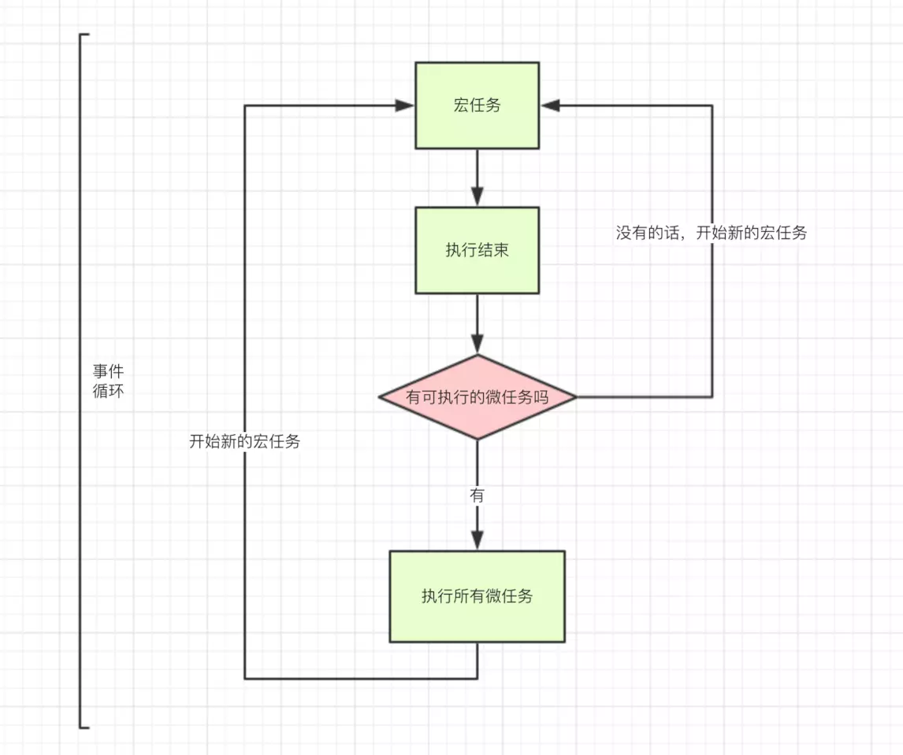

#### 深拷贝和浅拷贝
浅复制 —-只是拷贝了基本类型的数据，而引用类型数据，复制后也是会发生引用，我们把这种拷贝叫做“（浅复制）浅拷贝”，换句话说，浅复制仅仅是指向被复制的内存地址，如果原地址中对象被改变了，那么浅复制出来的对象也会相应改变。

深复制 —-在计算机中开辟了一块新的内存地址用于存放复制的对象。
浅拷贝实例
<!-- more -->
``` javascript 
//此递归方法不包含数组对象
var obj = { a:1, arr: [2,3] };
var shallowObj = shallowCopy(obj);

function shallowCopy(src) {
  var newobj = {};
  for (var prop in src) {
    if (src.hasOwnProperty(prop)) {
      newobj[prop] = src[prop];
    }
  }
  return newobj;
}
```
导致的结果就是：
shallowObj.arr[1] = 5;
console.log(obj.arr[1]);   //  5
深拷贝实例
``` javascript
var obj = { 
    a:1, 
    arr: [1,2]，
    nation : '中国',
    birthplaces:['北京','上海','广州']
};
var obj2 = {name:'杨'};
obj2 = deepCopy(obj,obj2);
console.log(obj2);
//深复制，要想达到深复制就需要用递归
function deepCopy(o,c){
   var c = c || {}；
   for(var i in o){
   if(typeof o[i] === 'object'){
          //要考虑深复制问题了
          if(o[i].constructor === Array){
            //这是数组
            c[i] =[]；
          }else{
            //这是对象
            c[i] = {}；
          }
          deepCopy(o[i],c[i])；
        }else{
          c[i] = o[i]；
        }
     }
     return c
 }
```
#### 线程与进程
`进程`：一个程序是静态的，通常是存放在外存中的。而当程序被调入内存中运行后，就成了进程。
`线程`：一个进程内部可能包含了很多顺序执行流，每个顺序执行流就是一个线程。`多线程`就是有多条顺序执行流“同时”[并发]执行，且它们之间互不干扰。
两者的区别：一个程序至少有一个进程,一个进程至少有一个线程。多线程的意义在于一个应用程序中，有多个执行部分可以同时执行。来实现进程的调度和管理以及资源分配。

#### 阻塞与非阻塞
阻塞和非阻塞这两个概念与程序（线程）等待消息通知(无所谓同步或者异步)时的状态有关。也就是说阻塞与非阻塞主要是程序（线程）等待消息通知时的状态角度来说的。
`阻塞`调用是指调用结果返回之前，当前线程会被挂起，一直处于等待消息通知，不能够执行其他业务。函数只有在得到结果之后才会返回。
`非阻塞`指在不能立刻得到结果之前，该函数不会阻塞当前线程，而会立刻返回。

#### 同步与异步
`同步`:所谓同步就是一个任务的完成需要依赖另外一个任务时，只有等待被依赖的任务完成后，依赖的任务才能算完成，这是一种可靠的任务序列。要么成功都成功，失败都失败，两个任务的状态可以保持一致。
`异步`: 异步是不需要等待被依赖的任务完成，只是通知被依赖的任务要完成什么工作，依赖的任务也立即执行，只要自己完成了整个任务就算完成了。至于被依赖的任务最终是否真正完成，依赖它的任务无法确定，所以它是不可靠的任务序列。
`消息通知`: 异步的概念和同步相对。当一个同步调用发出后，调用者要一直等待返回消息（结果）通知后，才能进行后续的执行；当一个异步过程调用发出后，调用者不能立刻得到返回消息（结果）。实际处理这个调用的部件在完成后，通过状态、通知和回调来通知调用者。

#### http
##### 请求
http请求包含有请求头，请求行，请求正文。
``` javascript
axios({
  method: 'post',
  url: '/user/12345',
  headers:{
    'Content-Type':'application/x-www-form-urlencoded'  
  },
  data: {
    firstName: 'Fred',
    lastName: 'Flintstone'
  }
});
```
method和url就是这个请求的请求行（这里是请求行部分信息，其实请求行还包括http协议的版本等信息）。headers中的属性就是请求头，里面的属性，全部包含在请求的header里面，是服务端获取客户端版本，缓存等信息的一个途径。data对应的就是请求正文，也就是平常所说的参数。
##### 响应
在请求发出去，并且响应已经回来的时候，就时候信息可分为响应行，响应头，响应正文。
`响应行`:返回请求的http协议及版本，状态码，请求状态等描述信息。
`响应头`:响应头和请求头格式一致，返回版本，缓存等信息。
`响应正文`:也就是日常开发需要用到的数据。
##### 常见的HTTP相应状态码
200：请求成功
400：参数错误
403：拒绝或者禁止访问（无权限访问）
404：地址不存在
405：客户端请求中的方法被禁止（一般是请求方式错误）
500：服务器报错
502：请求超时，无效网关
503：服务器超载或者维护，无法响应
##### https
HTTPS=数据加密+网站认证+完整性验证+HTTP
#### 响应式和自适应
响应式：一个网页，根据屏幕的宽度的改变而展示不同的效果，代码基本是两套以上。在所有屏幕上都展示很好的效果，但是设计，开发成本高。
<div  align="center">
</div>
自适应：一个网页，根据屏幕宽度的改变而改变。代码只有一套。在个别的屏幕上，排版这个比较丑，但是设计，开发成本低。
<div  align="center">
</div>

#### 盒子模型
1.IE5盒子  
width = 内容 + border + padding                
盒子占据的宽度 = margin*2+width 
2.W3C盒子 
width = 内容 
盒子占据的宽度 = margin*2+border*2+padding*2+width 
3.设置浏览器去遵循w3c标准 
只需要在网页的顶部加上DOCTYPE声明即可 
另外注意 !important 的使用 
  p{ 
   color:red !important; 
   color:blue; 
   } 
当不加!important;的时候，后者覆盖前者，当加上之后说明第一个,样式优先级更高，采用前者，但是Ie6不支持!important; 
#### 块级元素和内联元素
在标准文档流里面，块级元素具有以下特点：

①总是在新行上开始，占据一整行；
②高度，行高以及外边距和内边距都可控制；
③宽带始终是与浏览器宽度一样，与内容无关；
④它可以容纳内联元素和其他块元素。

行内元素的特点：

①和其他元素都在一行上；
②高，行高及外边距和内边距部分可改变；
③宽度只与内容有关；
④行内元素只能容纳文本或者其他行内元素。
不可以设置宽高，其宽度随着内容增加，高度随字体大小而改变，内联元素可以设置外边界，但是外边界不对上下起作用，只能对左右起作用，也可以设置内边界，但是内边界在ie6中不对上下起作用，只能对左右起作用
display:block  -- 显示为块级元素
display:inline  -- 显示为内联元素
dipslay:inline-block -- 显示为内联块元素，表现为同行显示并可修改宽高内外边距等属性.
#### 模块化编程
①AMD（异步模块定义） requirejs
异步加载，浏览器不会失去响应
它指定的回调函数，只有前面的模块都加载完成后，才会运行，解决了依赖性问题
②CMD（通用模块定义） seajs
模块定义方式和模块加载时机处理不同
③区别：AMD依赖前置，在定义模块的时候就要声明其依赖的模块；CMD就近依赖，只有在用到哪个模块的时候再去require；
#### 一个页面从URL到加载显示完成，都发生了什么？
1、首先，在浏览器地址栏中输入url
2、浏览器先查看浏览器缓存-系统缓存-路由器缓存，如果缓存中有，会直接在屏幕中显示页面内容。若没有，则跳到第三步操作。
3、在发送http请求前，需要域名解析(DNS解析)，解析获取相应的IP地址。
4、浏览器向服务器发起tcp连接，与浏览器建立tcp三次握手。
5、握手成功后，浏览器向服务器发送http请求，请求数据包。
6、服务器处理收到的请求，将数据返回至浏览器
7、浏览器收到HTTP响应
8、读取页面内容，浏览器渲染，解析html源码
9、生成Dom树、解析css样式、js交互
10、客户端和服务器交互
11、ajax查询
#### 前端安全
XSS：跨站脚本攻击，注入攻击的一种。攻击者利用应用程序的动态展示功能，在HTML页面中嵌入恶意代码。当用户浏览该页时，这些嵌入在html的恶意代码就会被执行，用户浏览器被攻击者控制。
CSRF:是跨站请求伪造。XSS利用站点内的信任用户，而CSRF则通过伪装来自受信任用户的请求来利用受信任的网站。其实就是攻击者盗用了你的身份，以你的名义发送恶意请求。
#### MVVM
Web 前端一种非常流行的开发模式，利用 MVVM 可以使我们的代码更专注于处理业务逻辑而不是去关心 DOM 操作。
#### Vue组件data为什么必须是函数
如果不用function return 每个组件的data都是内存的同一个地址，那一个数据改变其他也改变了，这当然就不是我们想要的。
用function return 其实就相当于申明了新的变量，相互独立，自然就不会有这样的问题。
#### javascript有哪几种数据类型
六种基本数据类型
undefined
null
string
boolean
number
symbol(ES6)
一种引用类型
Object
#### 事件冒泡、事件捕捉、事件委托
`事件捕获`:从document到触发事件的那个节点，即自上而下的去触发事件。
`事件冒泡`:刚好相反，是从触发事件的那个节点一直到document，是自下而上的去触发事件。
绑定事件方法（addEventListener）的第三个参数，就是控制事件触发顺序是否为事件捕获。true,事件捕获；false,事件冒泡。默认false,即事件冒泡,所以当你对一个dom节点触发事件时，若外层的节点也设置了相应的事件函数，就会使外层的节点也触发自己的事件函数。
`事件委托`:当有多个类似的元素需要绑定事件时，一个一个去绑定即浪费时间，又不利于性能，这时候就可以用到事件委托，给他们的一个共同父级元素添加一个事件函数去处理他们所有的事件
阻止事件委托和冒泡：在事件函数中执行event.stopPropagation()
#### 原型链
构造函数创建一个对象：
``` javascript
function Person() {

}
var person = new Person();
person.name = 'Kevin';
console.log(person.name) // Kevin
```

`prototype`:每个函数都有一个 prototype 属性。prototype显式原型属性（只有函数有prototype,对象是没有的。）
`__proto__` :这是每一个JavaScript对象(除了 null )都具有的一个属性，叫__proto__隐式原型属性，这个属性会指向该对象的原型。
`constructor`:每个原型都有一个 constructor 属性指向关联的构造函数。
Person 就是一个构造函数，我们使用 new 创建了一个实例对象 person。
这里new关键字起到了以下几个作用：
 var obj  = {}; obj.__proto__ = Person.prototype; Person.call(obj); 
 1.创建了一个空对象obj。
 2.将这个空对象的隐式原型__proto__指向构造函数的显示原型prototype；如例，是将空对象的__proto__成员指向了Person函数对象prototype成员对象；从而形成了所谓的原型链：下图中的蓝色线。
 3.将构造函数的this指向实例（即空对象），并调用Person函数；


<div  align="center">
</div>

#### call、aplly、bind之间的区别
相同点：1.都是用来改变函数的this对象的指向的。
2.第一个参数都是this要指向的对象。
``` javascript
var xw={
    name: "小王",
    gender: "男",
    age: 24,
    say: function(){
        alert(this.name+" , "+this.gender+" ,今年"+this.age);
    },
	say1: function(school,grade){
        alert(this.name+" , "+this.gender+" ,今年"+this.age+" ,在"+school+"上"+grade);
    }
}
var xh={
    name: "小红",
    gender: "女",
    age: 18
}
xw.say();
```
`xw.say1.call(xh,"实验小学","六年级");  `
`xw.say.apply(xh,["实验小学","六年级"]); `
`xw.say.bind(xh,"实验小学","六年级")(); `
三者的区别应该可以从上面三者调用方式可以看出来了。
#### sessionStorage、localStorage和cookie
共同点：都是保存在浏览器端、且同源的。
不同点：cookie数据始终在同源的http请求中携带（即使不需要），即cookie在浏览器和服务器间来回传递，而sessionStorage和localStorage不会自动把数据发送给服务器，仅在本地保存。
存储大小限制也不同，cookie数据不能超过4K。
数据有效期不同，sessionStorage：仅在当前浏览器窗口关闭之前有效；localStorage：始终有效，窗口或浏览器关闭也一直保存，因此用作持久数据；cookie：只在设置的cookie过期时间之前有效，即使窗口关闭或浏览器关闭。
作用域不同，sessionStorage不在不同的浏览器窗口中共享，即使是同一个页面；localstorage在所有同源窗口中都是共享的；cookie也是在所有同源窗口中都是共享的。
#### html5离线储存怎么使用，工作原理能不能解释一下？
HTML5的离线存储是基于一个新建的.appcache文件的，通过这个文件上的解析清单离线存储资源，这些资源就会像cookie一样被存储了下来。之后当网络在处于离线状态下时，浏览器会通过被离线存储的数据进行页面展示。
#### javascript中实现继承
``` javascript
//  父类 
        function Persion(name,age){ 
        	this.name = name; 
        	this.age = age; 
        }
        // 父类的原型对象属性继承 
        Persion.prototype.id = 10;
        // 子类 
        function Boy(name,age,sex){ 
        	//call apply 借用构造函数的方式继承
        	Persion.call(this,name,age);
        	this.sex = sex;
        }
        // 原型继承实现  参数为空 代表 父类的实例和父类的原型对象的关系了
	 Boy.prototype = new Persion();
         var b = new Boy('c5',27,'男'); 
         alert(b.name)// c5 
         alert(b.id)//10
```
#### javascript的执行机制
首先javascript是一门单线程语言。按照语句出现的顺序执行的.
<div  align="center">
</div>
同步和异步任务分别进入不同的执行"场所"，同步的进入主线程，异步的进入Event Table并注册函数。当指定的事情完成时，Event Table会将这个函数移入Event Queue。主线程内的任务执行完毕为空，会去Event Queue读取对应的函数，进入主线程执行。上述过程会不断重复，也就是常说的Event Loop(事件循环)。

js异步又细分为：
macro-task(宏任务)：包括整体代码script，setTimeout，setInterval
micro-task(微任务)：Promise.then()，process.nextTick
<div  align="center">
</div>
事件循环的顺序，决定js代码的执行顺序。进入整体代码(宏任务)后，开始第一次循环。接着执行所有的微任务。然后再次从宏任务开始，找到其中一个任务队列执行完毕，再执行所有的微任务。
就是遇到宏任务，先执行宏任务，将宏任务放入eventqueue，然后在执行微任务，将微任务放入eventqueue，这两个queue不是一个queue。当你往外拿的时候先从微任务里拿这个回调函数，然后再从宏任务的queue上拿宏任务的回调函数。
#### for in 和for of的区别
for in更适合遍历对象。
for in遍历的是数组的索引（即键名），而for of遍历的是数组元素值。

``` javascript
var  arrs = [1,2,3,4.5];
  for(let x in arrs){
      console.log(x)  // 输出结果的0,1,2,3
}

  for(let x of arrs){
  console.log(x); //输出结果是1，2，3，4.5
}
```
for..of适用遍历数/数组对象/字符串/map/set等拥有迭代器对象的集合.但是不能遍历对象,因为没有迭代器对象.与forEach()不同的是，它可以正确响应break、continue和return语句。